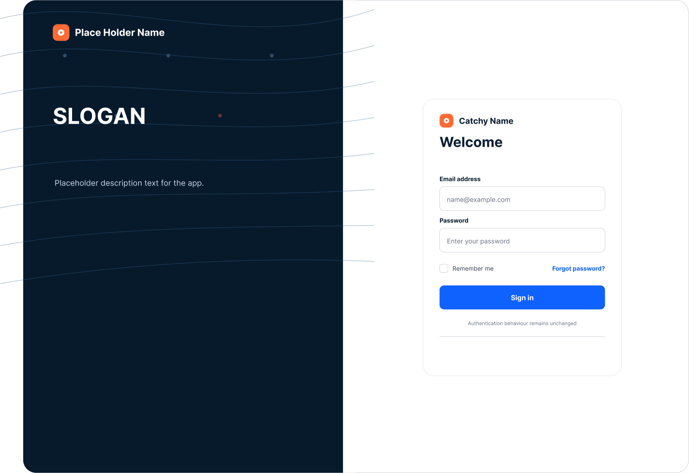
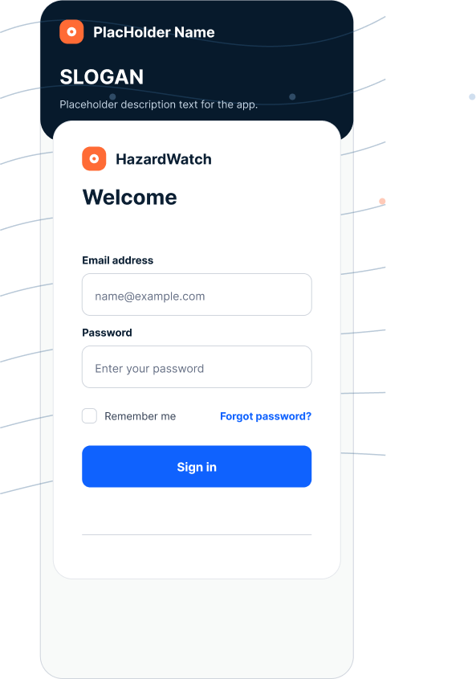
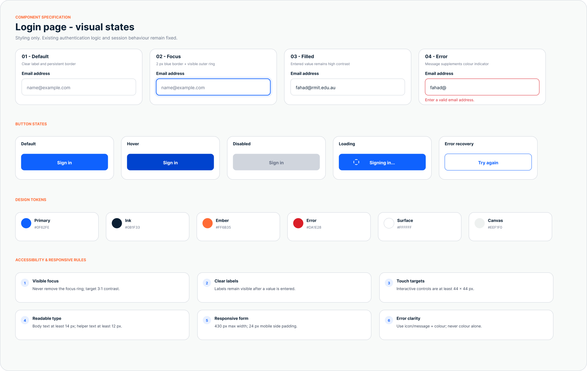
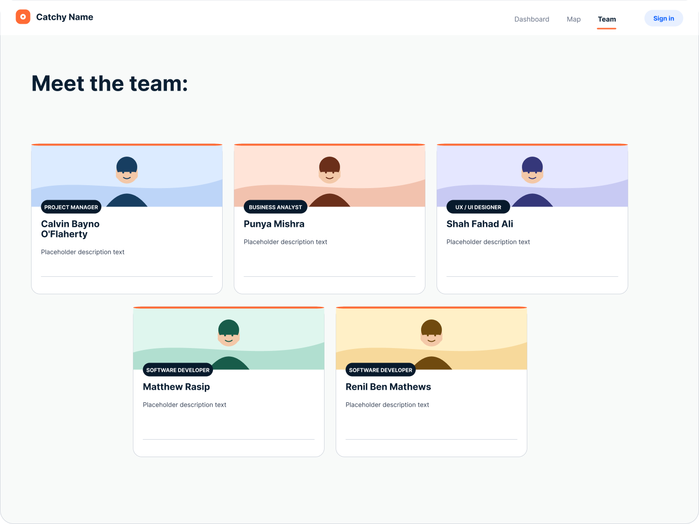
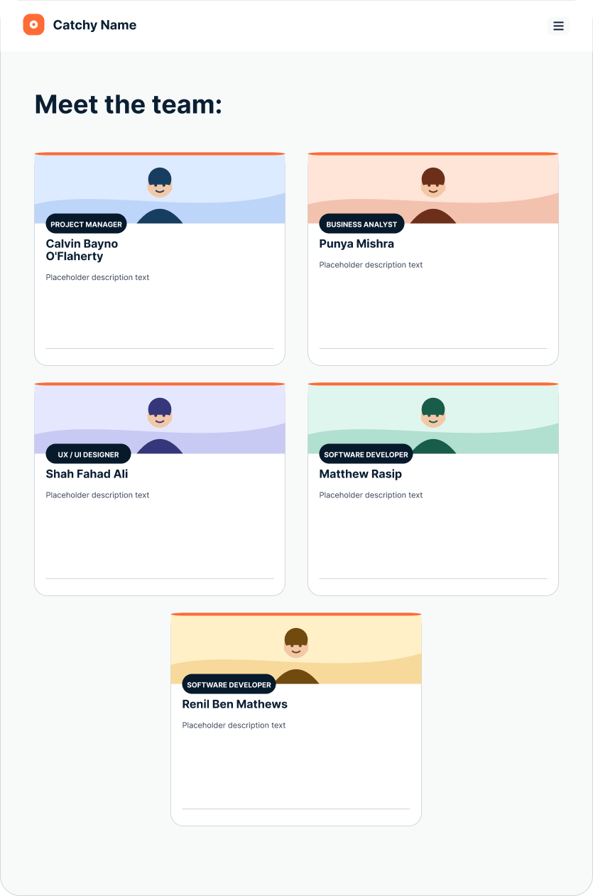
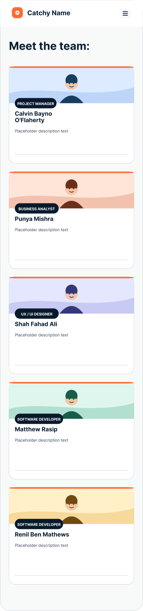
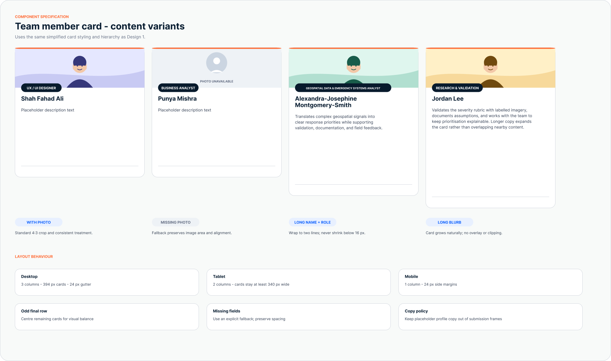

# Login and Team Page UX/UI Designs

This document contains the login and team page design

## Login page

### Desktop version

### Mobile version

### Form and button states

The specification asked for different states for the buttons. It also records the design tokens and accessibility rules used by the login form.

## Team page

### Desktop version

### Tablet version

### Mobile version

### Team member card states

The card specification asks to account for missing photos, long names and roles, long descriptions, responsive column behaviour etc.

## Notes

- Desktop, tablet, and mobile layouts preserve the same visual hierarchy. 
- Team cards change from three columns on desktop to two columns on tablet and one column on mobile this makes it more pleasing to the eye. 
- Placeholder brand names, slogans, descriptions, and profile copy will be repleaced to real ones, once it is decided upon by team.
